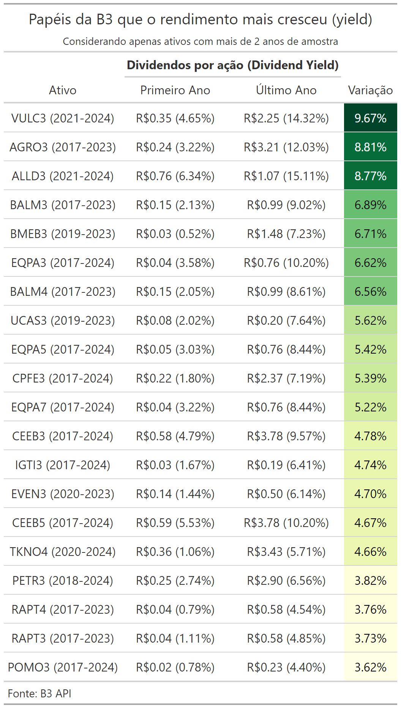

<!-- README.md is generated from README.Rmd. Please edit that file -->

```{r, include = FALSE}
knitr::opts_chunk$set(
  collapse = TRUE,
  comment = "#>"
)
```

# Dados de dividendo das empresas da B3

Esse projeto visa coletar os dados de preços de ações e seus dividendos da empresas da B3.  
Neste caso utilizou-se o pacote `tidyquant` como um facilitador para acessar os dados.




